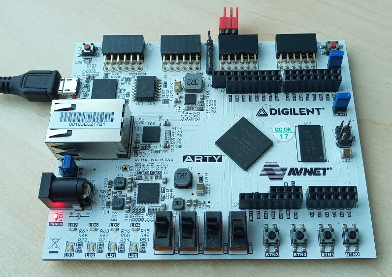

* Connect via micro-USB (J10 connector)
* Make external connections using red jumpers on a PMOD-3 (JC), see setup.jpg:
- PMOD JC-0 <-> PMOD JC-4
- PMOD JC-1 <-> PMOD JC-5
- PMOD JC-2 <-> PMOD JC-6

* Execute: C:\Testonica\QuickInstruments\python_runtime\python.exe ARTY.py